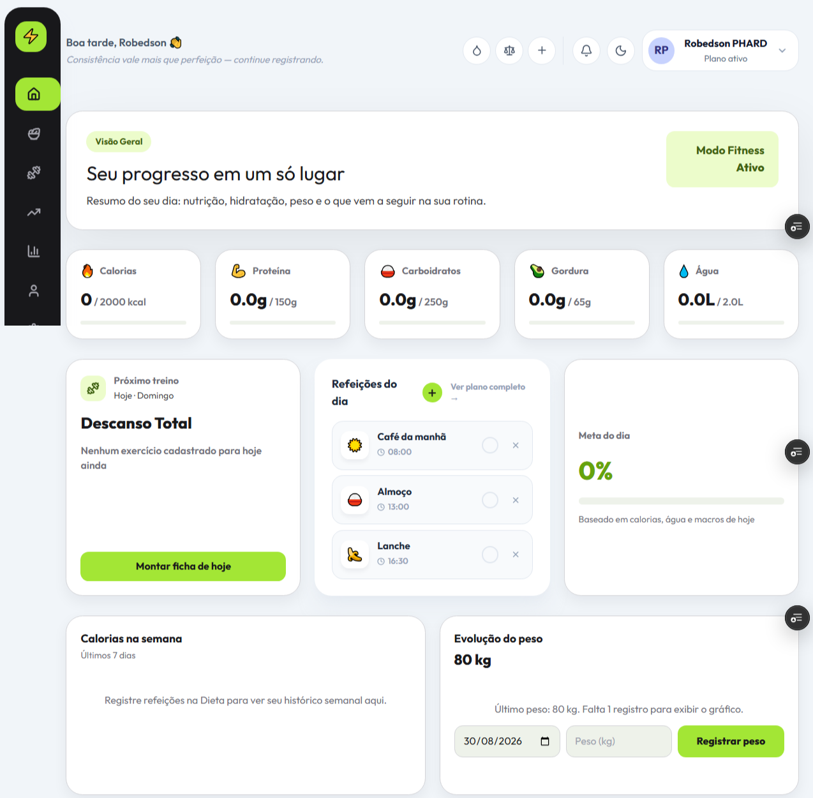
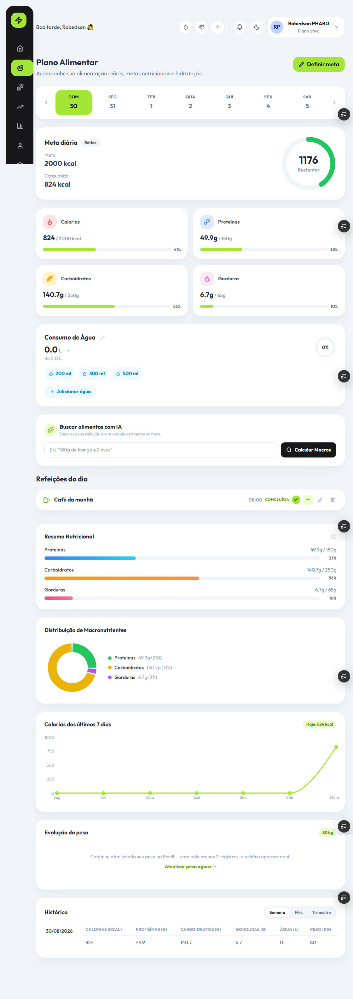
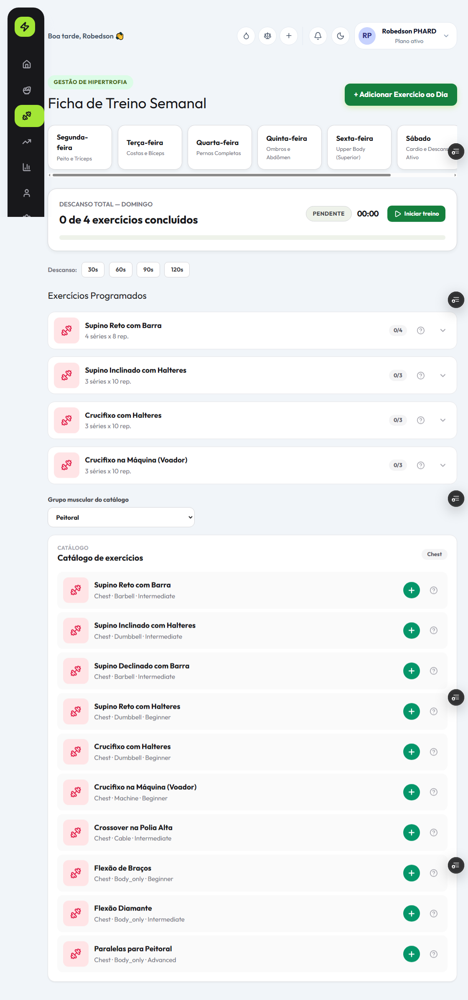
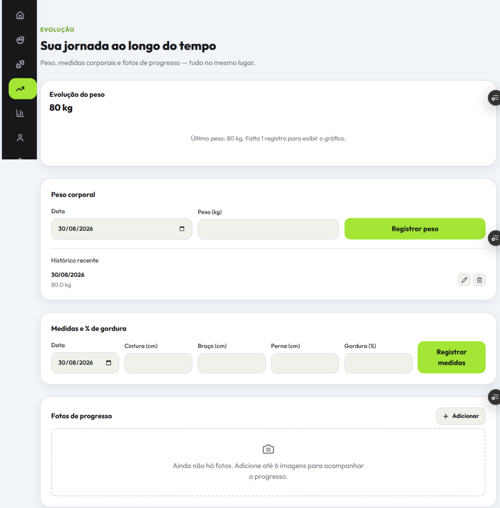

# System Fitness

Plataforma full stack para gestão de treinos, nutrição e acompanhamento de evolução física.

O projeto utiliza uma arquitetura desacoplada, com frontend em React e API REST em Spring Boot, autenticação via JWT, persistência em PostgreSQL e deploy em serviços cloud.

## 📸 Demonstração Visual

### Dashboard Principal
Resumo diário com metas de calorias e macronutrientes, próximo treino, refeições programadas e evolução do peso em um único painel.



### Gestão Nutricional e Dieta
Registro de refeições com cálculo de macros assistido por IA, controle de hidratação e histórico nutricional detalhado.



### Catálogo e Fichas de Treino
Ficha de treino organizada por dia da semana, com catálogo de exercícios filtrável por grupo muscular e nível de dificuldade.



### Evolução e Acompanhamento Corporal
Acompanhamento de peso, medidas corporais e fotos de progresso para visualizar a evolução física ao longo do tempo.



---

## Produção

- **Frontend:** https://app-fitness-murex.vercel.app
- **Backend:** https://app-fitness-mpmk.onrender.com

---

## Tecnologias

### Backend

- Java 21
- Spring Boot 4.x
- Spring Security
- JWT
- Spring Data JPA
- Hibernate
- PostgreSQL
- Flyway
- Maven
- Docker

### Frontend

- React
- Vite
- TypeScript / JavaScript
- Tailwind CSS
- Axios
- Lucide Icons

### Infraestrutura

- **Vercel** — hospedagem e deploy do frontend
- **Render** — execução do backend
- **Neon** — PostgreSQL Serverless

---

## Funcionalidades

- **Autenticação:** cadastro, login e controle de acesso com JWT.
- **Nutrição:** registro de refeições, acompanhamento de calorias, macronutrientes e consumo de água.
- **Treinos:** criação e organização de fichas e exercícios.
- **Evolução:** acompanhamento de peso, medidas e metas corporais.
- **Segurança:** proteção de endpoints e configuração controlada de CORS.

---

## Estrutura do Projeto

```text
app_fitness/
├── backend/
│   └── app_fitness-main/
│       ├── src/main/java/        # API, serviços, entidades e segurança
│       ├── src/main/resources/   # Configurações e migrations Flyway
│       ├── Dockerfile
│       └── pom.xml
│
├── frontend/
│   ├── src/                      # Páginas, componentes, contextos e serviços
│   ├── public/
│   └── package.json
│
├── docker-compose.yml
└── README.md